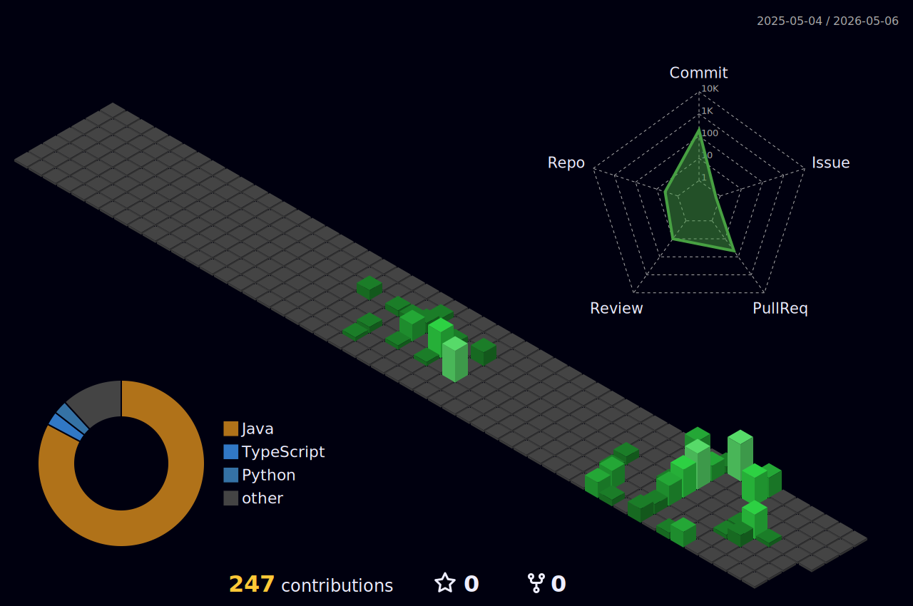

<div align="center">

[](https://git.io/typing-svg)

</div>

---

```
╔══════════════════════════════════════════════════════════╗
║  DECRYPTING  ::  0x41555245 4255 4953 4E45               ║
╚══════════════════════════════════════════════════════════╝

  NAME      : Aurelien Buisne
  USER_ID   : TheTitanOfTime
  CLEARANCE : STUDENT
  SPEC      : Computer Science + Behavioral Neuroscience
  INST      : Quinnipiac University
  STATUS    : [ ACTIVE ]
```

---

<div align="center">


</div>

---

## >> PROTOCOLS\_LOADED


---

## >> ACTIVE\_PROCESSES

```
  SLOT_01   : ░░░░░░░░░░░░░░░░░░░░░░░░░░░░░░  0% [ INITIALIZING ]
```

---

## >> COMPLETED\_OPERATIONS

```
╔══════════════════════════════════════════════════════════╗
║  0x5345523232355F525047  ::  OPERATION COMPLETE          ║
╚══════════════════════════════════════════════════════════╝

  CODENAME  : Requiem For A Gnome
  TYPE      : Turn-based RPG
  PROTOCOL  : Agile / Scrum  [ SER225 ]
  AGENTS    : 4 devs + 1 Scrum Master
  ARCHIVE   : github.com/bbailor/SER225
```

---

## >> ESTABLISH\_CONNECTION

[](https://www.linkedin.com/in/aurelienbuisine/)

---




<picture>
  <source media="(prefers-color-scheme: dark)"
    srcset="https://raw.githubusercontent.com/TheTitanOfTime/TheTitanOfTime/output/github-snake-dark.svg">
  <source media="(prefers-color-scheme: light)"
    srcset="https://raw.githubusercontent.com/TheTitanOfTime/TheTitanOfTime/output/github-snake.svg">
  
</picture>
